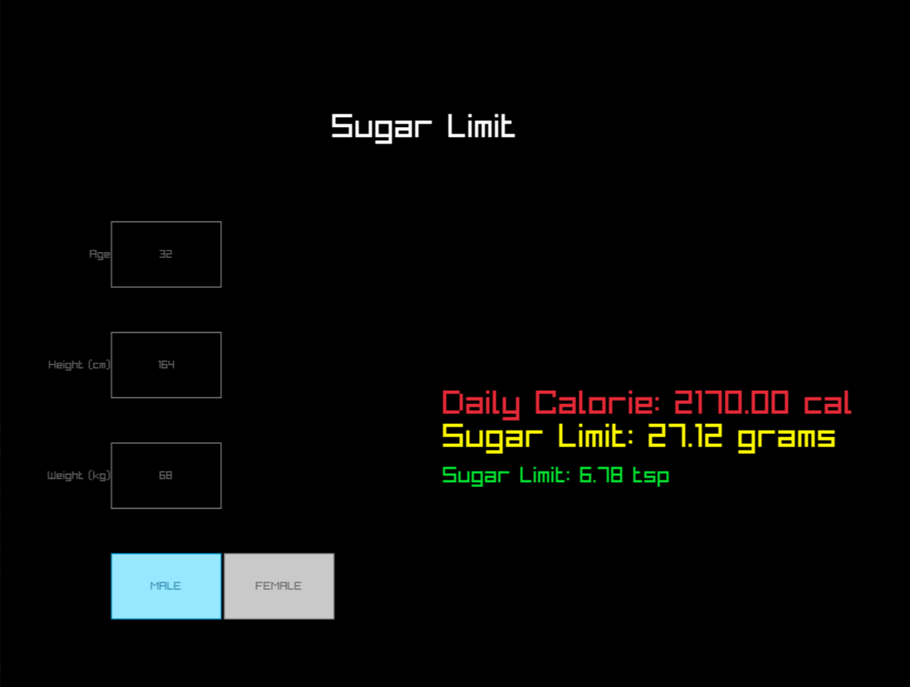

# Sugar Limit

A Minimal Gui Calculator that calculates your sugar Limit Per day.
---



---

## Usage
### Download Pre-Compiled Binary from Release tab
**For Linux** 
```bash
chmod +x sugar_linux
./sugarlinux
```
**For Windows:**
just click and run the sugar_win.exe <br>

`Press Q to Quit` or close window.


---

## Build
- Install Raylib in your Computer |  For **Arch** install Raylib using `paru -S raylib`.
- Run `make export`
- **For Windows:** Install `GNU Make` and run `make export`